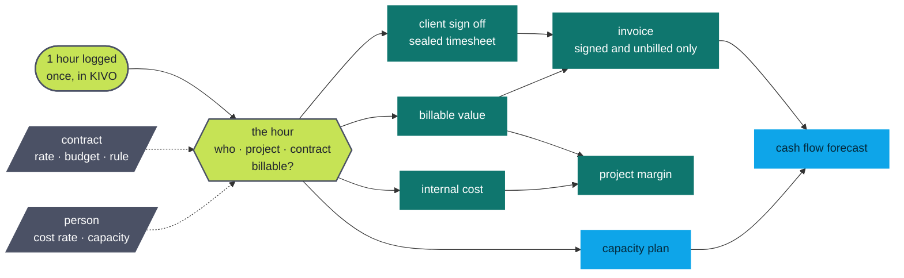
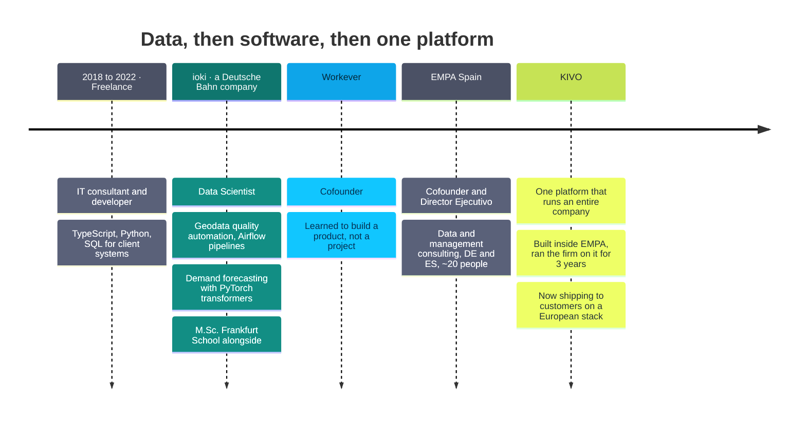

<div align="center">


[](https://www.linkedin.com/in/yannickaaron/)
[](https://kivo.eco)
[](https://empa.co)


&nbsp;

</div>

Data scientist turned full stack builder. I design data platforms, ship the software that runs on
them, and use AI where it actually pays off, not where it merely demos well.

---

## 🚀 Currently building: KIVO

> **A European business management platform built to run companies on one connected data foundation.**

Instead of moving information between disconnected systems, data is captured where it originates and
immediately becomes part of the wider business context, enabling automated processes, better
decisions and a view of the company that is always current. Today KIVO is built for service
businesses. The vision is to grow it into the operating system through which midsized companies
across industries manage, understand and steer their entire organisation.

It is not a traditional ERP, and that word does not really fit. KIVO is a holistic system for
running the whole business rather than one more tool sitting next to all the others.

### The problem

Companies run on a pile of separate systems: lead management here, project management there,
documents and devices somewhere else, plus onboarding, HR software and employee contracts. The data
ends up scattered, and even companies that already own an ERP keep a constellation of extra systems
around it. So people spend their days carrying information from system A to system B,
cross checking it, consolidating it, preparing it for someone else. What finally comes out is
usually already out of date, and rarely the right information at the right moment.

### The solution: finished processes, not an empty shell

Unlike Odoo and friends, KIVO arrives ready to use. Think of the Apple principle: you are not only
buying software, you are getting the well designed, tested processes that come with it.

* **Operational on day one.** Import your data, start working, trust the processes.
* **No consultants, no technical setup**, and no bending KIVO around the processes you happen to have today.
* **No separate automation layer** bolted on because automation is the current buzzword. The processes for lead management, device management, HR contracts and the rest ship finished, already fed by the right data, and they always look at the business as a whole.

### Data is captured where it originates

No transfer between systems, no double entry, no two readings of the same fact. Standard cases run
by themselves and the system only speaks up when something is out of the ordinary or a decision is
genuinely needed. Report sick leave, and the notification, the follow up and the people who need to
know are all handled.

Everything downstream derives from that single capture:



### Decisions that already carry their context

Sick leave, vacation, projects, working hours, invoices, employee and freelancer contracts, expenses:
all of it is connected, which is what makes a day by day financial view and a genuinely usable cash
flow forecast possible. A vacation request arrives with its consequences already calculated: the
cost, the project plan for those weeks, and a warning when a project is put at risk or planned time
can no longer be billed. Whoever decides has the relevant facts in front of them, and management
sees across the whole business.

### Our approach to AI

Deterministic by default. Most business data and processes are deterministic, so we solve them that
way. No AI spam. AI is used where it genuinely earns its place: in expense management, receipts are
read and validated in the background, so the employee hears immediately that the VAT number is
missing or the invoice recipient is wrong, long before anything reaches administration.

And KIVO is the foundation the next AI actually needs: a strong API, all relevant data in one
system, and a semantic understanding of what that data means. No data lake project, no data
governance programme to launch first.

### Europe first

100% European infrastructure on Scaleway, with no American services underneath, European AI models,
encryption throughout and very high standards for data security. The mission is to help Europe
digitalise and become AI ready, not by throwing AI at broken foundations, but by building the
infrastructure and the data foundation that lets it work at all.


Row level isolation with a `tenant_id` on every row, tenant scoped storage prefixes, the customer's
own KMS key encrypting data at rest, and prompts that never leave the EU.

### Why it is not an automation project

Automation projects are fashionable and they fail for a boring reason: they automate an inefficient
process instead of fixing it. The old way of working gets digitised rather than rethought. KIVO
brings the process with it, so the administrative overhead disappears because the automation lives
inside the process rather than on top of it.

Built by a management consulting firm around real operational problems, worked on for three years,
with two customers in production. Nothing vibe coded overnight. 🇩🇪 🇪🇸

---

## 🧭 What I actually do

```
Data Strategy  ──►  Governance, data models, AI readiness for large organisations
Engineering    ──►  TypeScript / Next.js / tRPC / Prisma / Postgres, from schema to shipped UI
AI             ──►  LLM pipelines with eval harnesses, agents, document intelligence
Analytics      ──►  Spatiotemporal forecasting, geodata, ML in production (PyTorch, Airflow)
Business       ──►  Cofounder, P&L, hiring, and the unglamorous operations in between
```



* 🏗️ **Cofounder & Director Ejecutivo**, EMPA Spain, data and management consulting across DE and ES
* 🤖 Deep in **AI supported business intelligence** and software automation, including the fun parts of the EU AI Act
* 🎓 **M.Sc. Management (Data & Business Analytics)**, Frankfurt School. Thesis: geospatial time series forecasting with transformers *(with ioki, a Deutsche Bahn company)*
* 🖨️ Off keyboard: 3D printing with **Klipper**, and pretending Valencia's weather is a productivity tool

---

## 🛠️ Toolbox

<div align="center">

**Languages**

[](https://skillicons.dev)

**Web & app**

[](https://skillicons.dev)

**Data, AI & infra**

[](https://skillicons.dev)

`tRPC` · `LangChain` · `Airflow` · `Mistral` · `Scaleway` · `MongoDB` · `Klipper`

</div>

---

## 📌 A few public repos

| Repo | What it is |
|---|---|
| [`lexware-client-ts`](https://github.com/YannickAaron/lexware-client-ts) | Modern, fully typed TypeScript client for the Lexware API |
| [`BetterMSFile`](https://github.com/YannickAaron/BetterMSFile) | A saner explorer app for OneDrive and SharePoint |
| [`quick-docu-mcp`](https://github.com/YannickAaron/quick-docu-mcp) | MCP server for quick documentation capture |
| [`scw-easy-container-redeploy`](https://github.com/YannickAaron/scw-easy-container-redeploy) | GitHub Action to redeploy a Scaleway container by name |
| [`TimeSeriesForecasting`](https://github.com/YannickAaron/TimeSeriesForecasting) | Spatiotemporal forecasting experiments |

> 🔒 Most of my daily work, KIVO included, lives in private repos. The stats below are the honest version.

---

## 📊 Stats

<div align="center">


</div>

### 🧊 The year, in three dimensions

<div align="center">

<picture>
  <source media="(prefers-color-scheme: dark)" srcset="https://raw.githubusercontent.com/YannickAaron/YannickAaron/output-3d/profile-kivo-dark.svg">
  <source media="(prefers-color-scheme: light)" srcset="https://raw.githubusercontent.com/YannickAaron/YannickAaron/output-3d/profile-kivo-light.svg">
  
</picture>

<picture>
  <source media="(prefers-color-scheme: dark)" srcset="https://raw.githubusercontent.com/YannickAaron/YannickAaron/output/github-snake-dark.svg">
  <source media="(prefers-color-scheme: light)" srcset="https://raw.githubusercontent.com/YannickAaron/YannickAaron/output/github-snake.svg">
  
</picture>

</div>

<details>
<summary>🕹️ …and an arcade cabinet, because the grid was just sitting there</summary>

<picture>
  <source media="(prefers-color-scheme: dark)" srcset="assets/arcade/pacman-contribution-graph-dark.svg">
  <source media="(prefers-color-scheme: light)" srcset="assets/arcade/pacman-contribution-graph.svg">
  
</picture>

<picture>
  <source media="(prefers-color-scheme: dark)" srcset="assets/arcade/galaga-contribution-graph-dark.svg">
  <source media="(prefers-color-scheme: light)" srcset="assets/arcade/galaga-contribution-graph.svg">
  
</picture>

</details>

---

## 🤝 Let's talk

If you are wrestling with data governance, an AI project that stalled on messy data, or a company
drowning in the administration between its tools, that is my favourite kind of conversation.

<div align="center">

[](https://www.linkedin.com/in/yannickaaron/)
[](https://empa.co)
[](https://kivo.eco)

🇩🇪 Deutsch · 🇬🇧 English · 🇪🇸 Español

</div>
