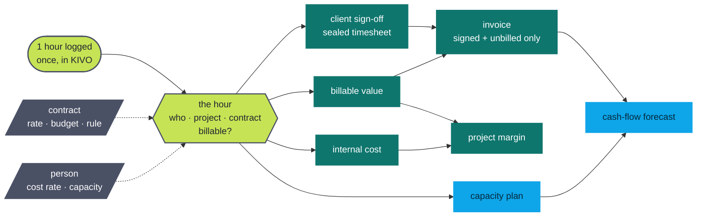
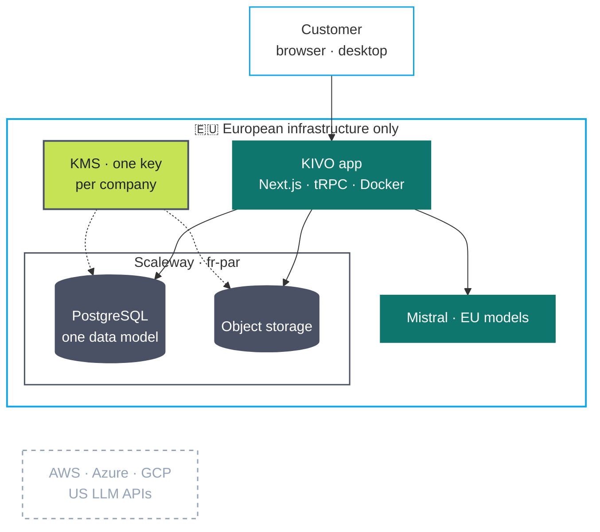

<div align="center">



[](https://www.linkedin.com/in/yannickaaron/)
[](https://kivo.eco)
[](https://empa.co)


&nbsp;

</div>

Data scientist turned full-stack builder. I design data platforms, ship the software that runs on
them, and use AI where it actually pays off — not where it merely demos well.

---

## 🚀 Currently building: KIVO

> **One platform that runs your entire company — and removes the administration that runs you.**

KIVO replaces the tool-zoo with a ready-to-use company platform: CRM, projects, contracts, time,
billing, HR, absences, expenses, documents, equipment and financial planning — all of it **one
business software**, working as one system from day one. No implementation project, no integrator's
phone number: the processes ship already thought through and legally exact.

The mechanism, drawn — **one hour is logged once, and everything downstream derives from it:**



Nobody re-types anything, so the data is **AI-ready by construction** — no cleaning project before
the first model. And it runs on **solely European infrastructure**: Scaleway for hosting and storage,
Mistral for AI, a dedicated encryption key per customer company. Your data stays yours.

**The stack, in full — there is no US cloud in it:**



Row-level isolation with a `tenant_id` on every row, tenant-scoped storage prefixes, the customer's
own KMS key encrypting data at rest, and prompts that never leave the EU.

Built inside our own consultancy for three years, scaled that company on it, now running for
external customers. 🇩🇪 🇪🇸

---

## 🧭 What I actually do

```
Data Strategy  ──►  Governance, data models, AI readiness for large organisations
Engineering    ──►  TypeScript / Next.js / tRPC / Prisma / Postgres — from schema to shipped UI
AI             ──►  LLM pipelines with eval harnesses, agents, document intelligence
Analytics      ──►  Spatio-temporal forecasting, geodata, ML in production (PyTorch, Airflow)
Business       ──►  Co-founder, P&L, hiring, and the unglamorous operations in between
```


- 🏗️ **Co-Founder & Director Ejecutivo**, EMPA Spain — data & management consulting across DE/ES
- 🤖 Deep in **AI-supported business intelligence** and software automation — including the fun parts of the EU AI Act
- 🎓 **M.Sc. Management (Data & Business Analytics)**, Frankfurt School — thesis: geospatial time-series forecasting with transformers *(with ioki / Deutsche Bahn)*
- 🖨️ Off-keyboard: 3D printing with **Klipper**, and pretending Valencia's weather is a productivity tool

---

## 🛠️ Toolbox

<div align="center">

**Languages**

[](https://skillicons.dev)

**Web & app**

[](https://skillicons.dev)

**Data, AI & infra**

[](https://skillicons.dev)

`tRPC` · `LangChain` · `Airflow` · `Mistral` · `Scaleway` · `MongoDB` · `Klipper`

</div>

---

## 📌 A few public repos

| Repo | What it is |
|---|---|
| [`lexware-client-ts`](https://github.com/YannickAaron/lexware-client-ts) | Modern, type-safe TypeScript client for the Lexware API |
| [`BetterMSFile`](https://github.com/YannickAaron/BetterMSFile) | A saner explorer app for OneDrive & SharePoint |
| [`quick-docu-mcp`](https://github.com/YannickAaron/quick-docu-mcp) | MCP server for quick documentation capture |
| [`scw-easy-container-redeploy`](https://github.com/YannickAaron/scw-easy-container-redeploy) | GitHub Action to redeploy a Scaleway container by name |
| [`TimeSeriesForecasting`](https://github.com/YannickAaron/TimeSeriesForecasting) | Spatio-temporal forecasting experiments |

> 🔒 Most of my day-to-day work (KIVO included) lives in private repos — the stats below are the honest version.

---

## 📊 Stats

<div align="center">


[](https://profile.codersrank.io/user/yannickaaron)

</div>

### 🧊 The year, in three dimensions

<div align="center">

<picture>
  <source media="(prefers-color-scheme: dark)" srcset="https://raw.githubusercontent.com/YannickAaron/YannickAaron/output-3d/profile-kivo-dark.svg">
  <source media="(prefers-color-scheme: light)" srcset="https://raw.githubusercontent.com/YannickAaron/YannickAaron/output-3d/profile-kivo-light.svg">
  
</picture>

<picture>
  <source media="(prefers-color-scheme: dark)" srcset="https://raw.githubusercontent.com/YannickAaron/YannickAaron/output/github-snake-dark.svg">
  <source media="(prefers-color-scheme: light)" srcset="https://raw.githubusercontent.com/YannickAaron/YannickAaron/output/github-snake.svg">
  
</picture>

</div>

<details>
<summary>🕹️ …and an arcade cabinet, because the grid was just sitting there</summary>

<picture>
  <source media="(prefers-color-scheme: dark)" srcset="assets/arcade/pacman-contribution-graph-dark.svg">
  <source media="(prefers-color-scheme: light)" srcset="assets/arcade/pacman-contribution-graph.svg">
  
</picture>

<picture>
  <source media="(prefers-color-scheme: dark)" srcset="assets/arcade/galaga-contribution-graph-dark.svg">
  <source media="(prefers-color-scheme: light)" srcset="assets/arcade/galaga-contribution-graph.svg">
  
</picture>

</details>

---

## 🤝 Let's talk

If you're wrestling with data governance, an AI project that stalled on messy data, or a company
drowning in the administration between its tools — that's my favourite kind of conversation.

<div align="center">

[](https://www.linkedin.com/in/yannickaaron/)
[](https://empa.co)
[](https://kivo.eco)

🇩🇪 Deutsch · 🇬🇧 English · 🇪🇸 Español

</div>
